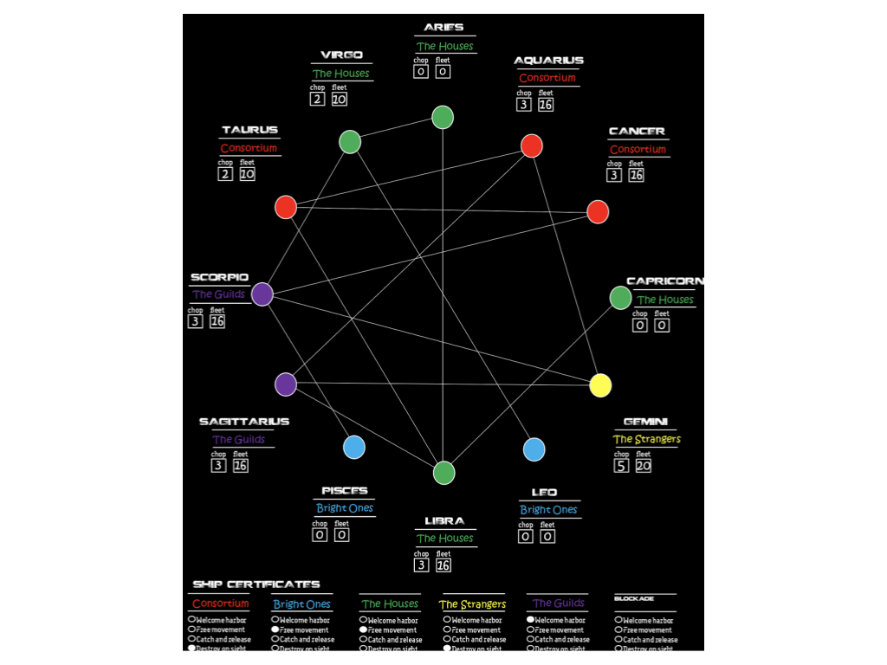
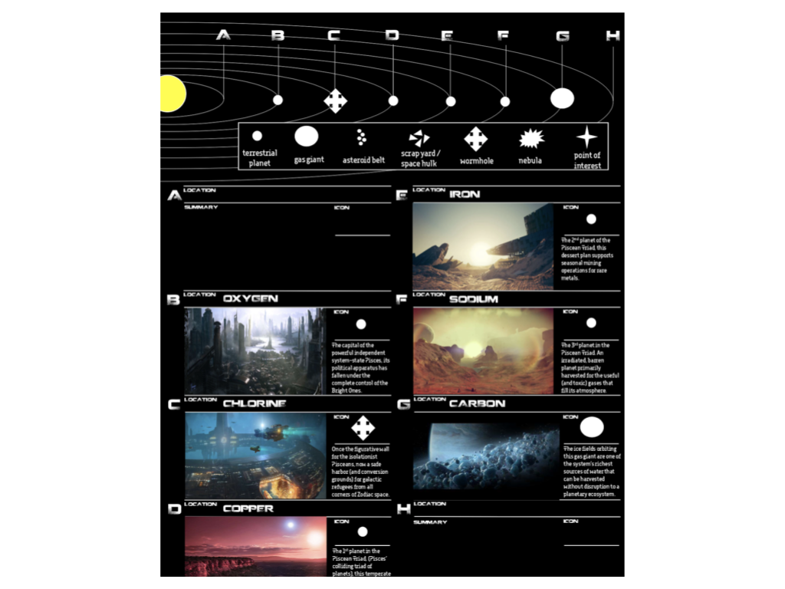

# *Ouroboros* overview

## Unraveling the secrets of the Piscean pre-cog command

### License

*Airlock* © Chad Walker.

Original campaign content CC BY Chad Sansing. See https://creativecommons.org/licenses/by/4.0/ for an explanation of the license.

### Table of contents

- Inspirations
- TL;DR
- Overview
- PCs
- Goals
- Hooks
- Sector map
- System map

### Inspirations

- *Adjudication Space*, an Airlock campaign
- Egyptian history and mythology
- *Event Horizon*
- "Futureblind," an Airlock 1-shot
- *House of Suns* by Alastair Reynolds
- *The Expanse* series by James S.A. Corey
- Machine learning
- *Zodiac Space*, an Airlock campaign

### TL;DR

After boarding a derelict colony ship that shouldn’t exist, a first-response team of Piscean pre-cog commandos finds itself enmeshed in a spiraling web of intrigue that connects the past, present, and future of Zodiac Space.

### Overview

Ouroboros takes place in Zodiac Space, a sector of the galaxy contested by rival societies and forces. Those factions include:

- The Bright Ones, an alliance between Leo and Pisces based on their people’s shared belief in the Bright Ones.
- The Consortium, an expansionist, militaristic, technological federation.
- The Guild, a shrewd capitalist political faction posing as a workers’ collective.
- The Houses, an empire emblematic of tradition, and family rule.
- The Strangers, an alien force occupying the Gemini system.

Recently:

- The Houses, the Iridians, and the Pisceans all suffered massive military defeats - the Houses and Iridians at the hands of the Consortium and the Pisceans at the hands of the Strangers.
- The Piscean pre-cog command began surveilling the Piscean regular military and civilian government to counteract Bright One influence on Pisces’s future.
- The Guild moved to occupy free Antimony Station in Scorpio after the mercenary crew of the Barghest and the House dreadnaught the Revenant sparked a rebellion in that system and seized control of its gas mining operations from the Consortium.
- The Bright Ones evacuated a large number of followers from Antimony Station to the Gemini system, baffling observers.

Currently in Pisces:

- The civilian government, led by Counselor Gethu, is mobilizing a small fleet for an expedition into Gemini, the purpose of which is unknown.
- The Piscean high council, made up of representatives from the pre-cog command (the pragmatist Zharga), the regular military (the zealot Gethu), and the civilian government (the pragmatist Byorme), is investigating Piscean involvement in the rebellion on Antimony Station.
- Deep space sensor buoys have detected a large, unpowered ship bearing a decades-old Piscean certificate floating into the gravity well of the Piscean Triad: the pre-cog training-ground planets of Copper, Iron, and Sodium that pass one another in irregular orbits at the edge of the system, catastrophically affecting each other in a seemingly random progression of near-misses and the occasional atmospheric collision.

That’s where you come in, commandos.

### PCs

See also: [character creation notes](/character-creation-notes.md).

The PCs in Ouroboros are all members of the same Piscean pre-cog commando squad: a team of first-responders specializing in a variety of ship-boarding actions including assassination, exfiltration, recon, repair, rescue, sabotage, salvage, signals monitoring, and disabling or taking over derelict and enemy vessels.

That means your PC might be a great:

- Adjudicator (a special class of commando authorized by treaty to arbitrate disputes throughout Zodiac Space).
- Black-badge (a special class of commando authorized for wetworks).
- Engineer.
- Heavy machine operator.
- Medic.
- Pilot.
- Psychopomps  (a special class of commando trained for gonzo Doom Patrol-like suicide missions).
- Sniper.
- Spy.
- Systems tech.
- Warrior.

Or your PC might be something else entirely (an interpreter or negotiator, for example). The big idea is to have a specialty and think of your PC as part of a team that has trained and worked together for some time aboard the same vessel.

You are also all part of the Piscean pre-cog command. You have bleeding-edge gear, elite training, and incredible powers tied to your ability to anticipate the future. How your powers manifest themselves is unique to your character. Your super strength might come from intuitively knowing exactly where to strike to cause the most damage to an opponent in motion. Your synchronicity might come from a subtle manipulation of probabilities that benefits you in any situation.

Pisceans seem somewhat aloof to other people in Zodiac Space. They are distracted by the future. All Pisceans have some ability to anticipate what will happen next. Pisceans who dedicate their lives to honing that  ability - like pre-cog commandos do - manifest extraordinary powers related to seeing across vast distances, seeing and following multiple possible futures (especially of those people closest to them) called “threads,” and impacting their environments in ways that push the present towards the futures they want.

Pisceans have adaptive identities and fluid genders and sexualities. They have different genders and sexualities at different times in their lives based on their needs, the environment, and the needs of others around them. This is kind of like Kemmer from The Left Hand of Darkness by Ursula K. LeGuin, but it can be more proactively controlled by a Piscean.

Pisceans have a fluid, aquatic aesthetic including blues, greens, and complementary accent colors, an appreciation for classical philosophy and references, and a stoicism stemming from their knowledge of multiple futures. They know some futures cannot pass, some are likely to pass, and some show up to surprise them. Pre-cog commandos have a somewhat darker and sharper aesthetic to blend into the shadows of present so they have maximum freedom of movement to shape the future.

Given names are often formal statements related to a Piscean’s core identity (like, “Looks with closed eyes” and “Brings Order from Chaos”). Callsigns are typically related  to a commando’s function on their team (like “Deadeye” the sniper or “Lifeboat” the medic).

Under the influence of the Bright Ones, a relatively new systems-wide religion, the Pisceans have formed an alliance with the Leo system. The Pisceans lost the Gemini system to the Strangers who have begun some kind of project to xenoform the system’s space stations and planets.

The Pisceans are not originally from the Pisces system - or at least not from its core. They arrived millenia ago, suppressed or killed indigenous life in the system, and occupied it as colonists and settlers.

After the Piscean conquest of that system, the Consortium, the Houses, and the Pisceans all signed on to a sector-wide treaty forbidding the construction of colony ships - or “generation ships” - and the colonization of any planet in a system claimed by another faction. The Guild signed on to this treaty shortly after its formation, as well. That treaty has been in effect for thousands of years.

Your PC begins play as a “heroic” voidnaut. That means you get:

- 2 Talents rated at 3.
- 2 Voidnetics.
- 2 Breaks.
	- These might be pieces of gear, reminders of home, souvenirs, or weapons.
- 2 Passages.
	- 1 passage might be related to your time training together on Iron at Camp Kronos.
	- 1 passage might be related to either a memorable mission you had together or part of your life before joining the Piscean pre-cog command.
- Phoenix Protocol enabled.

You should share your character with the other players during session 0 or session 1, as well as update your passages and determine your relationships then.

When a pre-cog is excommunicated, for lack of a better word, from the command, they are sentenced to full or partial damnatio memoriae - the obliteration of their history from all records of time. Some pre-cogs voluntarily undergo damnatio memoriae in order to “enjoy” more freedom and less accountability while acting as operatives.

### Goals

At the beginning of Ouroboros, the PCs’ goals will be to:

- Identify the derelict colony ship in the Triad’s gravity well.
- Hail the ship and establish contact if possible.
- Assess its threat to them.
- Board if able.
- - Determine the state of the ship and the disposition of any forces inside it.
- Reactivate the ship’s engines to keep it from drifting further into the system.
- Report back to Piscean high command for orders on what to do with the ship after that.

### Hooks

Things we might explore in Ouroboros include:

- Lifeboat’s family.
- Piscean culture and politics.
- Pre-cog command culture and politics.
- Sojourn’s Psychopomp status and damnatio memoriae.
- The edge of the Pisces system and its triad.
- The Gemini sector.
- The nature of precognition.
- The origin of the colony ship.
- The purpose of the colony ship.
- The squad’s shared history.
- The variety of pre-cogs’ missions and roles inside and outside Pisces.
- Where the colony ship has been.
- Concurrent events in Zodiac Space.

Sector and system maps follow below.

### Sector map

###System map

Last updated 2 April 2019
